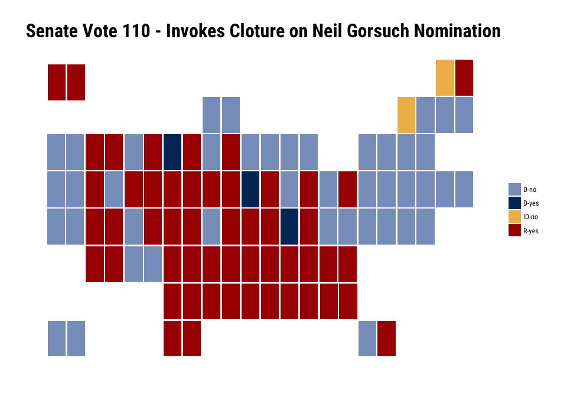

`voteogram` : U.S. House and Senate Voting Cartogram Generators

Produce voting cartograms in the style of 'ProPublica'.

### TODO

-   House cartogram
-   Colors for "not voting" & "present"
-   Cargo theme
-   Ability to retrieve votes from ProPublica.

The following functions are implemented:

-   `senate_carto`: Produce a Senate cartogram

### Installation

``` r
devtools::install_github("hrbrmstr/voteogram")
```

### Usage

``` r
library(voteogram)
library(jsonlite)
library(hrbrthemes)
library(tidyverse)

# current verison
packageVersion("voteogram")
```

    ## [1] '0.1.0'

``` r
df <- fromJSON("https://pp-projects-static.s3.amazonaws.com/congress/assets/senate_115_1_110.json")$votes
```

``` r
select(df, state_abbrev, district, party, position) %>% 
  senate_carto() +
  labs(title="Senate Vote 110 - Invokes Cloture on Neil Gorsuch Nomination") +
  theme_ipsum_rc(grid="", plot_title_size = 24) +
  theme(axis.text=element_blank())
```



### Test Results

``` r
library(voteogram)
library(testthat)

date()
```

    ## [1] "Sat May  6 13:49:35 2017"

``` r
test_dir("tests/")
```

    ## testthat results ========================================================================================================
    ## OK: 0 SKIPPED: 0 FAILED: 0
    ## 
    ## DONE ===================================================================================================================
