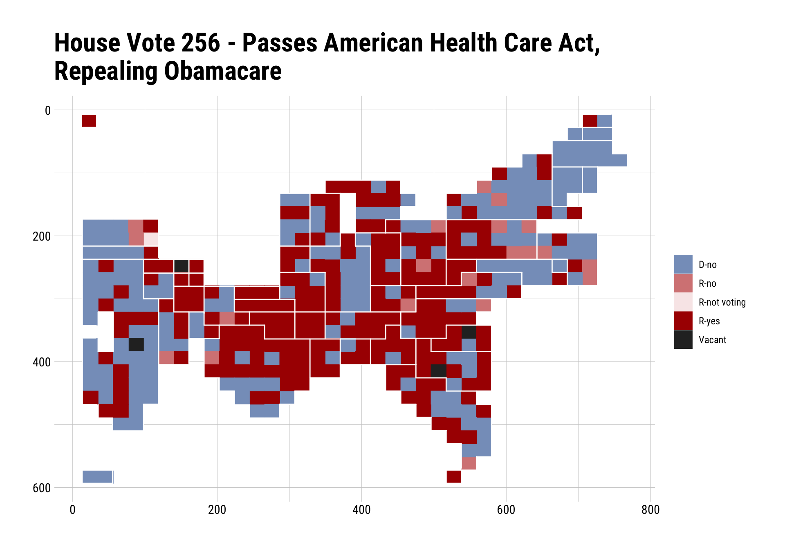
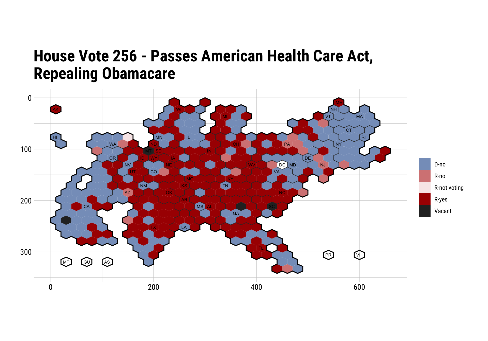

[](https://travis-ci.org/hrbrmstr/voteogram)
[](https://ci.appveyor.com/project/hrbrmstr/voteogram)
[](https://codecov.io/github/hrbrmstr/voteogram?branch=master)

# voteogram

U.S. House and Senate Voting Cartogram Generators

## Description

‘ProPublica’ <https://projects.propublica.org/represent/> makes United
States Congress member votes available and has developed their own
unique cartogram to visually represent this data as has ‘GovTrack’
<URL_AT_SOME_POINT> . Tools are provided to retrieve voting data,
prepare voting data for plotting with ‘ggplot2’, create vote cartograms
and theme them.

Ref: (these are replicated below)

  - <https://projects.propublica.org/represent/votes/115/senate/1/110>
  - <https://projects.propublica.org/represent/votes/115/house/1/256>
  - <https://www.govtrack.us/congress/votes/115-2017/h256>

You can grab the results of a roll call vote (House or Senate) with
`roll_call()`. It returns a `list` with a ton of information that you
can use outside this package. One element of that list is the
`data.frame` of vote results. You can pass in the *entire* object to
either `_carto()` function and it’ll “fortify” it before shunting it off
to ggplot2. Try to cache this data (I do, below, in R markdown chunk) as
you’re ticking credits off of ProPublica’s monthly free S3 allotment
each call. Consider donating to them if you’re too lazy to cache the
data).

## TODO

  - <strike>House cartogram generator</strike>
  - <strike>Param bulletproofing (param checking, et al)</strike>
  - <strike>Add in ability to retrieve votes from ProPublica.</strike>
  - <strike>Make a `voteogram` theme</strike>
  - <strike>GovTrack Senate cartogram polygons</strike> (this is pretty
    much covered in
    [`ggparliament`](https://github.com/leeper/ggparliament) since GT
    only has the seat view for the Senate)
  - <strike>“Independent” colors for “not voting” & “present”</strike>
  - <strike>Vignette</strike>
  - `htmlwidget` version

## What’s In The Tin

The following functions are implemented:

  - `house_carto`: Produce a ProPublica- or GovTrack-style House roll
    call vote cartogram
  - `senate_carto`: Produce a Senate cartogram
  - `roll_call`: Get Voting Record for House or Senate By Number,
    Session & Roll Call Number

Helpers:

  - `theme_voteogram`: voteogram ggplot2 theme
  - `print.pprc`: Better default ‘print’ function for `roll_call()`
    (`pprc`) objects
  - `fortify.pprc` : In case you want to use the voting data frame from
    a `roll_call()` (`pprc`) object in your own plots and forget to just
    `$votes` it out. \#helping

## Working with `voteogram`

### Installation

``` r
devtools::install_github("hrbrmstr/voteogram")
```

### Basic Usage

``` r
library(voteogram)
library(hrbrthemes)
library(ggplot2)

# current verison
packageVersion("voteogram")
```

    ## [1] '0.3.1'

``` r
sen <- roll_call("senate", 115, 1, 110)
rep <- roll_call("house", 115, 1, 256)
```

``` r
str(sen)
```

    ## List of 29
    ##  $ vote_id              : chr "S_115_1_110"
    ##  $ chamber              : chr "Senate"
    ##  $ year                 : int 2017
    ##  $ congress             : chr "115"
    ##  $ session              : chr "1"
    ##  $ roll_call            : int 110
    ##  $ needed_to_pass       : int 51
    ##  $ date_of_vote         : chr "April  6, 2017"
    ##  $ time_of_vote         : chr "12:35 PM"
    ##  $ result               : chr "Cloture Motion Agreed to"
    ##  $ vote_type            : chr "1/2"
    ##  $ question             : chr "On the Cloture Motion"
    ##  $ description          : chr "Neil M. Gorsuch, of Colorado, to be an Associate Justice of the Supreme Court of the United States"
    ##  $ nyt_title            : chr "On the Cloture Motion"
    ##  $ total_yes            : int 55
    ##  $ total_no             : int 45
    ##  $ total_not_voting     : int 0
    ##  $ gop_yes              : int 52
    ##  $ gop_no               : int 0
    ##  $ gop_not_voting       : int 0
    ##  $ dem_yes              : int 3
    ##  $ dem_no               : int 43
    ##  $ dem_not_voting       : int 0
    ##  $ ind_yes              : int 0
    ##  $ ind_no               : int 2
    ##  $ ind_not_voting       : int 0
    ##  $ dem_majority_position: chr "No"
    ##  $ gop_majority_position: chr "Yes"
    ##  $ votes                :Classes 'tbl_df', 'tbl' and 'data.frame':   100 obs. of  11 variables:
    ##   ..$ bioguide_id         : chr [1:100] "A000360" "B001230" "B001261" "B001267" ...
    ##   ..$ role_id             : int [1:100] 526 481 498 561 535 547 507 551 480 555 ...
    ##   ..$ member_name         : chr [1:100] "Lamar  Alexander" "Tammy Baldwin" "John Barrasso" "Michael Bennet" ...
    ##   ..$ sort_name           : chr [1:100] "Alexander" "Baldwin" "Barrasso" "Bennet" ...
    ##   ..$ party               : chr [1:100] "R" "D" "R" "D" ...
    ##   ..$ state_abbrev        : chr [1:100] "TN" "WI" "WY" "CO" ...
    ##   ..$ display_state_abbrev: chr [1:100] "Tenn." "Wis." "Wyo." "Colo." ...
    ##   ..$ district            : chr [1:100] "2" "1" "1" "1" ...
    ##   ..$ position            : chr [1:100] "Yes" "No" "Yes" "No" ...
    ##   ..$ dw_nominate         : logi [1:100] NA NA NA NA NA NA ...
    ##   ..$ pp_id               : chr [1:100] "TN" "WI" "WY" "CO" ...
    ##  - attr(*, "class")= chr [1:2] "pprc" "list"

``` r
sen$votes
```

    ## # A tibble: 100 x 11
    ##    bioguide_id role_id member_name   sort_name party state_abbrev display_state_ab… district position dw_nominate pp_id
    ##  * <chr>         <int> <chr>         <chr>     <chr> <chr>        <chr>             <chr>    <chr>    <lgl>       <chr>
    ##  1 A000360         526 Lamar  Alexa… Alexander R     TN           Tenn.             2        Yes      NA          TN   
    ##  2 B001230         481 Tammy Baldwin Baldwin   D     WI           Wis.              1        No       NA          WI   
    ##  3 B001261         498 John Barrasso Barrasso  R     WY           Wyo.              1        Yes      NA          WY   
    ##  4 B001267         561 Michael Benn… Bennet    D     CO           Colo.             1        No       NA          CO   
    ##  5 B001277         535 Richard Blum… Blumenth… D     CT           Conn.             2        No       NA          CT   
    ##  6 B000575         547 Roy  Blunt    Blunt     R     MO           Mo.               2        Yes      NA          MO   
    ##  7 B001288         507 Cory  Booker  Booker    D     NJ           N.J.              2        No       NA          NJ   
    ##  8 B001236         551 John  Boozman Boozman   R     AR           Ark.              1        Yes      NA          AR   
    ##  9 B000944         480 Sherrod  Bro… Brown     D     OH           Ohio              1        No       NA          OH   
    ## 10 B001135         555 Richard M. B… Burr      R     NC           N.C.              1        Yes      NA          NC   
    ## # ... with 90 more rows

``` r
str(rep)
```

    ## List of 29
    ##  $ vote_id              : chr "H_115_1_256"
    ##  $ chamber              : chr "House"
    ##  $ year                 : int 2017
    ##  $ congress             : chr "115"
    ##  $ session              : chr "1"
    ##  $ roll_call            : int 256
    ##  $ needed_to_pass       : int 216
    ##  $ date_of_vote         : chr "May  4, 2017"
    ##  $ time_of_vote         : chr "02:18 PM"
    ##  $ result               : chr "Passed"
    ##  $ vote_type            : chr "RECORDED VOTE"
    ##  $ question             : chr "On Passage"
    ##  $ description          : chr "American Health Care Act"
    ##  $ nyt_title            : chr "On Passage"
    ##  $ total_yes            : int 217
    ##  $ total_no             : int 213
    ##  $ total_not_voting     : int 1
    ##  $ gop_yes              : int 217
    ##  $ gop_no               : int 20
    ##  $ gop_not_voting       : int 1
    ##  $ dem_yes              : int 0
    ##  $ dem_no               : int 193
    ##  $ dem_not_voting       : int 0
    ##  $ ind_yes              : int 0
    ##  $ ind_no               : int 0
    ##  $ ind_not_voting       : int 0
    ##  $ dem_majority_position: chr "No"
    ##  $ gop_majority_position: chr "Yes"
    ##  $ votes                :Classes 'tbl_df', 'tbl' and 'data.frame':   435 obs. of  11 variables:
    ##   ..$ bioguide_id         : chr [1:435] "A000374" "A000370" "A000055" "A000371" ...
    ##   ..$ role_id             : int [1:435] 274 294 224 427 268 131 388 320 590 206 ...
    ##   ..$ member_name         : chr [1:435] "Ralph Abraham" "Alma  Adams" "Robert B. Aderholt" "Pete Aguilar" ...
    ##   ..$ sort_name           : chr [1:435] "Abraham" "Adams" "Aderholt" "Aguilar" ...
    ##   ..$ party               : chr [1:435] "R" "D" "R" "D" ...
    ##   ..$ state_abbrev        : chr [1:435] "LA" "NC" "AL" "CA" ...
    ##   ..$ display_state_abbrev: chr [1:435] "La." "N.C." "Ala." "Calif." ...
    ##   ..$ district            : int [1:435] 5 12 4 31 12 3 2 19 36 2 ...
    ##   ..$ position            : chr [1:435] "Yes" "No" "Yes" "No" ...
    ##   ..$ dw_nominate         : logi [1:435] NA NA NA NA NA NA ...
    ##   ..$ pp_id               : chr [1:435] "LA_5" "NC_12" "AL_4" "CA_31" ...
    ##  - attr(*, "class")= chr [1:2] "pprc" "list"

``` r
fortify(rep)
```

    ## # A tibble: 435 x 11
    ##    bioguide_id role_id member_name   sort_name party state_abbrev display_state_ab… district position dw_nominate pp_id
    ##  * <chr>         <int> <chr>         <chr>     <chr> <chr>        <chr>                <int> <chr>    <lgl>       <chr>
    ##  1 A000374         274 Ralph Abraham Abraham   R     LA           La.                      5 Yes      NA          LA_5 
    ##  2 A000370         294 Alma  Adams   Adams     D     NC           N.C.                    12 No       NA          NC_12
    ##  3 A000055         224 Robert B. Ad… Aderholt  R     AL           Ala.                     4 Yes      NA          AL_4 
    ##  4 A000371         427 Pete Aguilar  Aguilar   D     CA           Calif.                  31 No       NA          CA_31
    ##  5 A000372         268 Rick Allen    Allen     R     GA           Ga.                     12 Yes      NA          GA_12
    ##  6 A000367         131 Justin Amash  Amash     R     MI           Mich.                    3 Yes      NA          MI_3 
    ##  7 A000369         388 Mark Amodei   Amodei    R     NV           Nev.                     2 Yes      NA          NV_2 
    ##  8 A000375         320 Jodey Arring… Arrington R     TX           Texas                   19 Yes      NA          TX_19
    ##  9 B001291         590 Brian Babin   Babin     R     TX           Texas                   36 Yes      NA          TX_36
    ## 10 B001298         206 Don Bacon     Bacon     R     NE           Neb.                     2 Yes      NA          NE_2 
    ## # ... with 425 more rows

### ProPublica

``` r
senate_carto(sen) +
  labs(title="Senate Vote 110 - Invokes Cloture on Neil Gorsuch Nomination") +
  theme_ipsum_rc(plot_title_size = 24) +
  theme_voteogram()
```


``` r
house_carto(rep, pp_square=TRUE) +
  labs(x=NULL, y=NULL, 
       title="House Vote 256 - Passes American Health Care Act,\nRepealing Obamacare") +
  theme_ipsum_rc(plot_title_size = 24) +
  theme_voteogram()
```


``` r
house_carto(rep, pp_square=FALSE) +
  labs(x=NULL, y=NULL, 
       title="House Vote 256 - Passes American Health Care Act,\nRepealing Obamacare") +
  theme_ipsum_rc(plot_title_size = 24) +
  theme_voteogram()
```



### GovTrack

``` r
house_carto(rep, "gt") +
  labs(x=NULL, y=NULL, 
       title="House Vote 256 - Passes American Health Care Act,\nRepealing Obamacare") +
  theme_ipsum_rc(plot_title_size = 24) +
  theme_voteogram()
```



### Tiny Cartograms

They can be shrunk down well (though that means annotating them in some
other way):

``` r
senate_carto(sen) + theme_voteogram(legend=FALSE)
```


``` r
house_carto(rep) + theme_voteogram(legend=FALSE)
```


``` r
house_carto(rep, pp_square=TRUE) + theme_voteogram(legend=FALSE)
```


### Test Results

``` r
library(voteogram)
library(testthat)

date()
```

    ## [1] "Sun Sep 16 17:11:30 2018"

``` r
test_dir("tests/")
```

    ## ✔ | OK F W S | Context
    ## ══ testthat results  ════════════════════════════════════════════════════════════════════════════
    ## OK: 7 SKIPPED: 0 FAILED: 0
    ## 
    ## ══ Results ══════════════════════════════════════════════════════════════════════════════════════
    ## Duration: 0.6 s
    ## 
    ## OK:       0
    ## Failed:   0
    ## Warnings: 0
    ## Skipped:  0

## Code of Conduct

Please note that this project is released with a [Contributor Code of
Conduct](CONDUCT.md). By participating in this project you agree to
abide by its terms.
