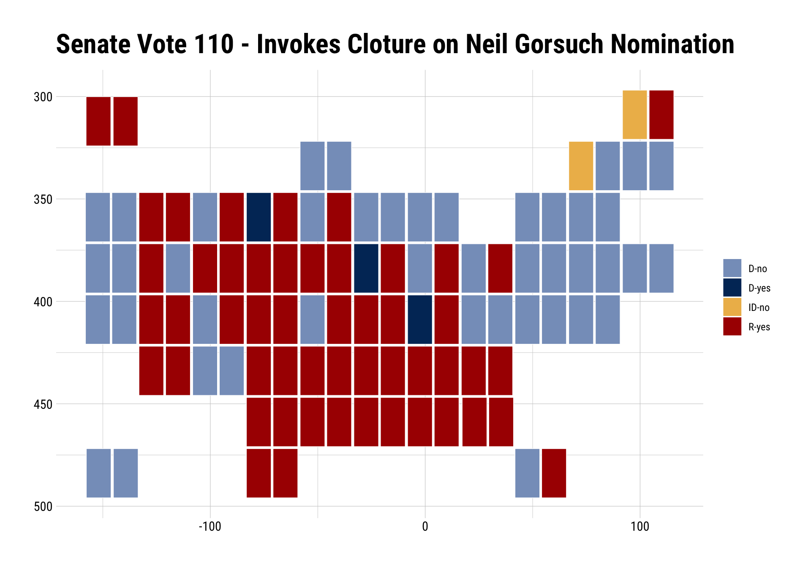
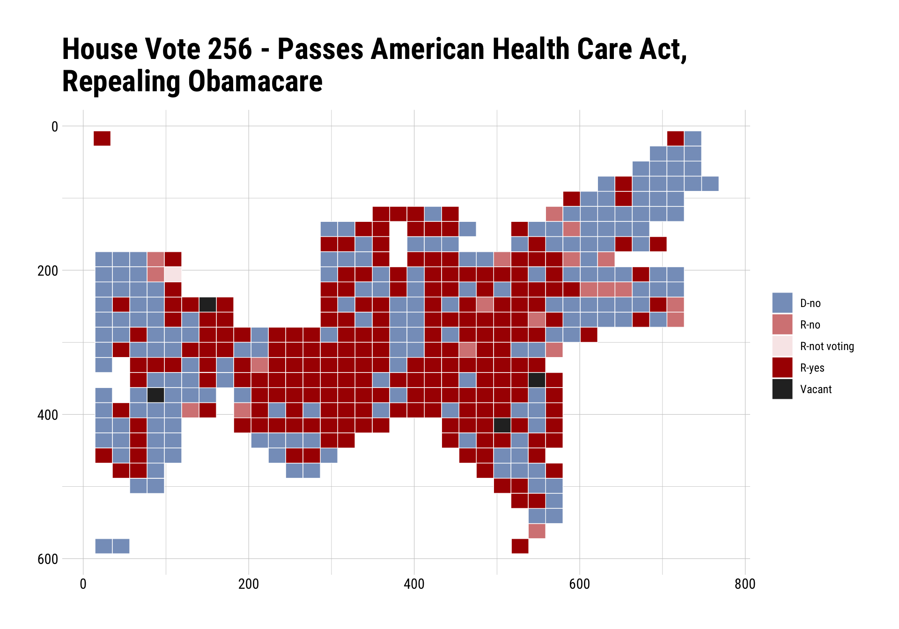

[](https://travis-ci.org/hrbrmstr/voteogram)
[](https://ci.appveyor.com/project/hrbrmstr/voteogram)
[](https://codecov.io/github/hrbrmstr/voteogram?branch=master)

# voteogram

U.S. House and Senate Voting Cartogram Generators

## Description

‘ProPublica’ <https://projects.propublica.org/represent/> makes United
States Congress member votes available and has developed their own
unique cartogram to visually represent this data as has ‘GovTrack’
<URL_AT_SOME_POINT> . Tools are provided to retrieve voting data,
prepare voting data for plotting with ‘ggplot2’, create vote cartograms
and theme them.

Ref: (these are replicated below)

  - <https://projects.propublica.org/represent/votes/115/senate/1/110>
  - <https://projects.propublica.org/represent/votes/115/house/1/256>
  - <https://www.govtrack.us/congress/votes/115-2017/h256>

You can grab the results of a roll call vote (House or Senate) with
`roll_call()`. It returns a `list` with a ton of information that you
can use outside this package. One element of that list is the
`data.frame` of vote results. You can pass in the *entire* object to
either `_carto()` function and it’ll “fortify” it before shunting it off
to ggplot2. Try to cache this data (I do, below, in R markdown chunk) as
you’re ticking credits off of ProPublica’s monthly free S3 allotment
each call. Consider donating to them if you’re too lazy to cache the
data).

## TODO

  - <strike>House cartogram generator</strike>
  - <strike>Param bulletproofing (param checking, et al)</strike>
  - <strike>Add in ability to retrieve votes from ProPublica.</strike>
  - <strike>Make a `voteogram` theme</strike>
  - <strike>GovTrack Senate cartogram polygons</strike> (this is pretty
    much covered in
    [`ggparliament`](https://github.com/leeper/ggparliament) since GT
    only has the seat view for the Senate)
  - <strike>“Independent” colors for “not voting” & “present”</strike>
  - <strike>Vignette</strike>
  - `htmlwidget` version

## What’s In The Tin

The following functions are implemented:

  - `house_carto`: Produce a ProPublica- or GovTrack-style House roll
    call vote cartogram
  - `senate_carto`: Produce a Senate cartogram
  - `roll_call`: Get Voting Record for House or Senate By Number,
    Session & Roll Call Number

Helpers:

  - `theme_voteogram`: voteogram ggplot2 theme
  - `print.pprc`: Better default ‘print’ function for `roll_call()`
    (`pprc`) objects
  - `fortify.pprc` : In case you want to use the voting data frame from
    a `roll_call()` (`pprc`) object in your own plots and forget to just
    `$votes` it out. \#helping

## Working with `voteogram`

### Installation

``` r
devtools::install_github("hrbrmstr/voteogram")
```

### Basic Usage

``` r
library(voteogram)
library(hrbrthemes)
library(ggplot2)

# current verison
packageVersion("voteogram")
```

    ## [1] '0.2.0'

``` r
sen <- roll_call("senate", 115, 1, 110)
rep <- roll_call("house", 115, 1, 256)
```

``` r
sen
```

    ## 115th Congress / Session: 1 / Senate Roll Call: 110 / April  6, 2017
    ## 
    ## Neil M. Gorsuch, of Colorado, to be an Associate Justice of the Supreme Court of the United States
    ## 
    ## Result: Cloture Motion Agreed to

``` r
sen$votes
```

    ## # A tibble: 100 x 11
    ##    bioguide_id role_id        member_name  sort_name party state_abbrev display_state_abbrev district position
    ##  *       <chr>   <int>              <chr>      <chr> <chr>        <chr>                <chr>    <chr>    <chr>
    ##  1     A000360     526   Lamar  Alexander  Alexander     R           TN                Tenn.        2      Yes
    ##  2     B001230     481      Tammy Baldwin    Baldwin     D           WI                 Wis.        1       No
    ##  3     B001261     498      John Barrasso   Barrasso     R           WY                 Wyo.        1      Yes
    ##  4     B001267     561     Michael Bennet     Bennet     D           CO                Colo.        1       No
    ##  5     B001277     535 Richard Blumenthal Blumenthal     D           CT                Conn.        2       No
    ##  6     B000575     547         Roy  Blunt      Blunt     R           MO                  Mo.        2      Yes
    ##  7     B001288     507       Cory  Booker     Booker     D           NJ                 N.J.        2       No
    ##  8     B001236     551      John  Boozman    Boozman     R           AR                 Ark.        1      Yes
    ##  9     B000944     480     Sherrod  Brown      Brown     D           OH                 Ohio        1       No
    ## 10     B001135     555    Richard M. Burr       Burr     R           NC                 N.C.        1      Yes
    ## # ... with 90 more rows, and 2 more variables: dw_nominate <lgl>, pp_id <chr>

``` r
rep
```

    ## 115th Congress / Session: 1 / House Roll Call: 256 / May  4, 2017
    ## 
    ## American Health Care Act
    ## 
    ## Result: Passed

``` r
fortify(rep)
```

    ## # A tibble: 435 x 11
    ##    bioguide_id role_id        member_name sort_name party state_abbrev display_state_abbrev district position
    ##  *       <chr>   <int>              <chr>     <chr> <chr>        <chr>                <chr>    <int>    <chr>
    ##  1     A000374     274      Ralph Abraham   Abraham     R           LA                  La.        5      Yes
    ##  2     A000370     294        Alma  Adams     Adams     D           NC                 N.C.       12       No
    ##  3     A000055     224 Robert B. Aderholt  Aderholt     R           AL                 Ala.        4      Yes
    ##  4     A000371     427       Pete Aguilar   Aguilar     D           CA               Calif.       31       No
    ##  5     A000372     268         Rick Allen     Allen     R           GA                  Ga.       12      Yes
    ##  6     A000367     131       Justin Amash     Amash     R           MI                Mich.        3      Yes
    ##  7     A000369     388        Mark Amodei    Amodei     R           NV                 Nev.        2      Yes
    ##  8     A000375     320    Jodey Arrington Arrington     R           TX                Texas       19      Yes
    ##  9     B001291     590        Brian Babin     Babin     R           TX                Texas       36      Yes
    ## 10     B001298     206          Don Bacon     Bacon     R           NE                 Neb.        2      Yes
    ## # ... with 425 more rows, and 2 more variables: dw_nominate <lgl>, pp_id <chr>

### ProPublica

``` r
senate_carto(sen) +
  labs(title="Senate Vote 110 - Invokes Cloture on Neil Gorsuch Nomination") +
  theme_ipsum_rc(plot_title_size = 24) +
  theme_voteogram()
```



``` r
house_carto(rep, pp_square=TRUE) +
  labs(x=NULL, y=NULL, 
       title="House Vote 256 - Passes American Health Care Act,\nRepealing Obamacare") +
  theme_ipsum_rc(plot_title_size = 24) +
  theme_voteogram()
```



``` r
house_carto(rep, pp_square=FALSE) +
  labs(x=NULL, y=NULL, 
       title="House Vote 256 - Passes American Health Care Act,\nRepealing Obamacare") +
  theme_ipsum_rc(plot_title_size = 24) +
  theme_voteogram()
```


### GovTrack

``` r
house_carto(rep, "gt") +
  labs(x=NULL, y=NULL, 
       title="House Vote 256 - Passes American Health Care Act,\nRepealing Obamacare") +
  theme_ipsum_rc(plot_title_size = 24) +
  theme_voteogram()
```


### Tiny Cartograms

They can be shrunk down well (though that means annotating them in some
other way):

``` r
senate_carto(sen) + theme_voteogram(legend=FALSE)
```


``` r
house_carto(rep) + theme_voteogram(legend=FALSE)
```


``` r
house_carto(rep, pp_square=TRUE) + theme_voteogram(legend=FALSE)
```


### Test Results

``` r
library(voteogram)
library(testthat)

date()
```

    ## [1] "Sun Nov 26 07:39:47 2017"

``` r
test_dir("tests/")
```

    ## testthat results ========================================================================================================
    ## OK: 7 SKIPPED: 0 FAILED: 0
    ## 
    ## DONE ===================================================================================================================

## Code of Conduct

Please note that this project is released with a [Contributor Code of
Conduct](CONDUCT.md). By participating in this project you agree to
abide by its terms.
